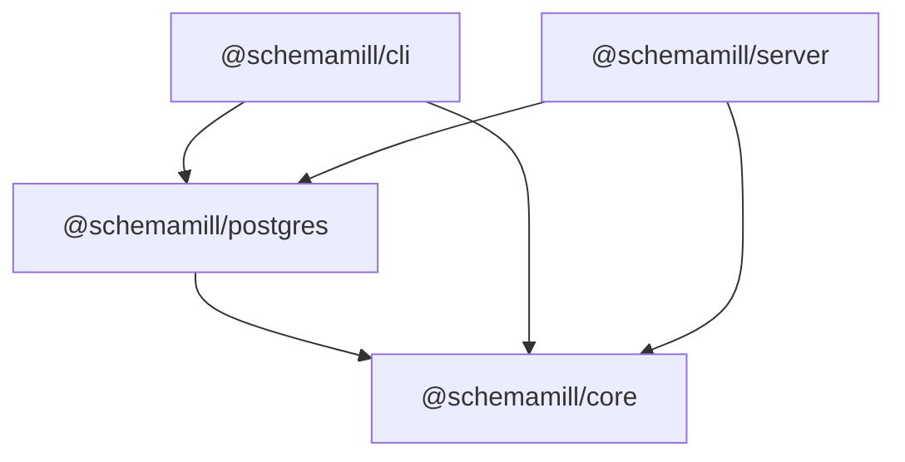

# Architecture

**Status:** drafted 2026-09-21 · living document

## What this describes

This document describes schemamill's structure: the packages it is built from, the boundaries between them, the dialect seam, and how the CLI and the studio's server compose the engine. It fixes shape, not behavior. Behavior — the canonical model's internals, import and introspection, planning and rendering, commands and endpoints — attaches at the points named here and is designed separately, in the domain documents and the decision records.

## Packages

schemamill is built from four packages, scoped `@schemamill/*`:

- **`@schemamill/core`** — the canonical model and the change engine, plus the declarations of the dialect seam. Zero runtime dependencies and framework-free: plain TypeScript, no decorators, no dependency injection, no framework types. Every surface shares it.
- **`@schemamill/postgres`** — the only package that knows PostgreSQL: DDL parsing, read-only catalog introspection, migration SQL rendering, and hazard knowledge. It implements the seam declared in core. Nothing Postgres-specific passes beyond it.
- **`@schemamill/cli`** — the command-line surface. It composes core and postgres and stays thin: argument handling, output, and process concerns, with no domain logic of its own.
- **`@schemamill/server`** — the studio's local server, and the one place NestJS lives. It composes core and postgres, and framework plumbing stops at its edge.

Dependencies run one way only:

- core depends on nothing;
- postgres depends on core;
- cli and server depend on core and postgres;
- surfaces never depend on each other, and nothing depends on cli or server.

Arrows point from a package to what it depends on. Enforcement is structural, not conventional: strict package linking makes an undeclared import fail, and lint-level import restrictions cover the remaining directions.

If a family of dialect packages ever forms, they arrive as siblings of postgres, each depending on core — a direction, not a promise.

## The dialect seam

The seam is where the engine meets one database dialect. Its socket — the declarations — lives in core; its plug is postgres. Nothing of PostgreSQL's vocabulary crosses the boundary: catalog names, type spellings, and lock modes are translated at the seam into the canonical model and its change engine, and back into migration SQL. What follows is a sketch of shape, not final signatures.

- **`DdlImporter`** — DDL text → model plus diagnostics. Import is a translation, and diagnostics travel with the result so round-trip fidelity reporting has a home.
- **`CatalogReader`** — a read-only connection → model plus diagnostics. Introspection lands on the same shape as import, so the engine never needs to know which door a model came through.
- **`SqlRenderer`** — migration plan → migration SQL, deterministic. Rendering is the one outbound step, and determinism holds because the plan carries everything the SQL needs.
- **`HazardAnalyzer`** — planned changes → hazard annotations. A hazard describes what could hurt when the migration SQL is applied, so it belongs to the plan rather than to the rendered text.

Four ports cross the seam. Import and introspection are two, not one: their inputs differ in kind — DDL text versus a live, read-only connection — and their diagnostics answer different fidelity questions. Hazard analysis stands on its own: a hazard annotates a planned change, and the migration SQL is a rendering of the plan, so hazard knowledge belongs to planning, not behind the output step.

The model's internals — its objects and its representation of types — are deliberately not designed here. This document fixes where the seam is and what crosses it, not the shape of the payloads.

## Composition at the edges

The CLI and the server each compose core and postgres: they wire concrete implementations to the seam's declarations and call the engine. There is no dependency injection in core; wiring is explicit and the pieces are plain objects. The server may use NestJS's dependency injection at its own edge to assemble what its endpoints need, while the CLI calls core directly with no framework in the way. Composition is per-surface and local: no shared container, and core runs without a server.

## The structural layer

The structural layer consists of exactly this, and nothing more:

- a clean clone where build, lint, typecheck, and tests run green;
- the four packages with the dependency arrows enforced;
- the seam's declarations in `core`, with `postgres` implementing them only where a path needs the dialect;
- surfaces that boot with no domain behavior: the CLI answers `--version` and `--help`; the server binds localhost with no domain endpoints;
- a canary proving the surfaces reach the core — a shared version constant exercised by tests, not a feature;
- CI running build, lint, typecheck, and tests on the current Node lines.

The layer holds no parsing, no model design, no endpoints, no commands, no persistence, no canvas code; those are behavior, and behavior is designed separately.

## Where functionality attaches

The safe-change loop maps onto the seam without new structure. Import attaches to `DdlImporter` and `CatalogReader`; compare and planning attach to core's change engine, with `HazardAnalyzer` annotating the plan; rendering attaches to `SqlRenderer`. A first slice would implement one path end to end and add the minimal surface for it; boundaries and ports stay put as slices land.

Functionality design decides the first-order questions, among them:

- the canonical model's breadth — which objects it covers — and how it represents types;
- import diagnostics and round-trip fidelity reporting;
- the command and endpoint surfaces;
- persistence: where the model, snapshots, and the workspace live on disk;
- the studio's canvas code and how the server delivers it.

## Grounding

- **Decisions:** [0001 — Generate, never apply](./adr/0001-generate-never-apply.md) · [0002 — One canonical model](./adr/0002-canonical-model.md) · [0003 — Changes are snapshot diffs](./adr/0003-changes-are-snapshot-diffs.md) · [0004 — PostgreSQL only, behind a dialect seam](./adr/0004-postgresql-only-dialect-seam.md) · [0005 — Framework-free core](./adr/0005-framework-free-core.md) · [0006 — Local-first](./adr/0006-local-first.md)
- **Domain:** [Vision](./domain/vision.md) · [Core Domain](./domain/core-domain.md) · [Context Map](./domain/context-map.md) · [Principles & Refusals](./domain/principles-and-refusals.md) · [Ubiquitous Language](./domain/ubiquitous-language.md)
- **Glossary:** [CONTEXT.md](../CONTEXT.md)
